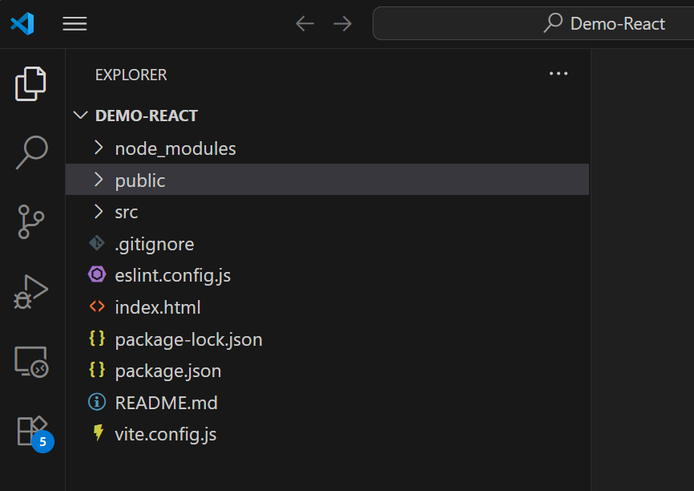
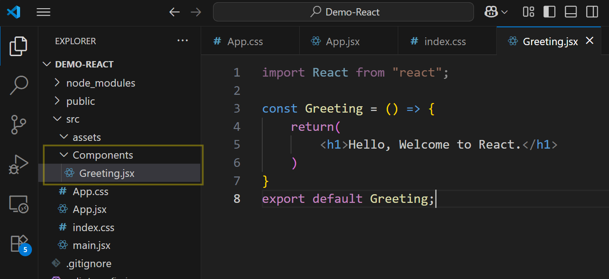
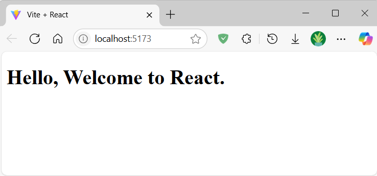
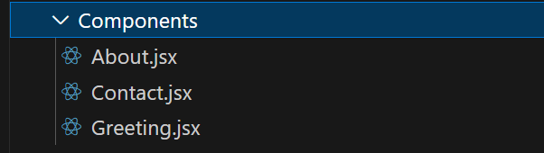
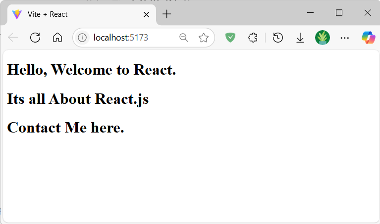

# 🚀 React.js – Day 3 Notes

## ✨ Setting Up a New React Project using Vite.
### Assume your project folder is:




# Generate Components
* ### Components are those pages which loads in `index.html` without reloading it.
* ### In project, components are placed as jsx in `src/components/` folder.

## Let's Create Greet Component.


## Also need to change code of `App.jsx`
```jsx
import React from 'react';
import Greeting from './components/greeting';

const App = () => {
  return (
    <div>
      <Greeting />
    </div>
  );
}

export default App;
```

### Note: We can Remove and Modify given Css and Jsx as require from `src`
---


### On `npm run dev` :


---

## 🔹Create more Components and add to `App.jsx`.


### App.jsx
```jsx
import React from 'react';
import Greeting from './components/greeting';
import About from './Components/About';
import Contact from './Components/Contact';

const App = () => {
  return (
    <div>
      <Greeting />
      <About/>
      <Contact/>
    </div>
  );
}

export default App;
```

### Load components without reload:


---
<br>

# Concept of Routing
### Here we render all components on page. we need single page at time. and change component using Navigation buttons. 
### For that, we will use `BrowserRouter`. which navigates components on page without reloading page.

### Working of BrowserRouter 🔁:
* ### Remove Placed content page from DOM.
* ### Load requested content page on DOM. (Replacing)
---
## Steps to setup BrowserRouter.
* ### Install React Router:
```jsx
npm install react-router-dom
```
* ### Set Up Routing to Load Components Without Page Reload
### main.jsx
```jsx
import React from "react";
import ReactDOM from "react-dom/client";
import { BrowserRouter } from "react-router-dom";
import App from "./App";

ReactDOM.createRoot(document.getElementById("root")).render(
  <BrowserRouter>
    <App />
  </BrowserRouter>
);
```
### Implement Routing in `App.jsx`
## Uses:
### `Routes`: Wrapper for all routes
### `Route`: Defines one path and component
### `Link`: Replaces `<a>` tag (no reload)
### `to`: Path to go when clicked
---

### App.jsx
```jsx
import React from 'react';
import { Routes, Route, Link } from "react-router-dom";
import Greeting from './components/greeting';
import About from './Components/About';
import Contact from './Components/Contact';
import "./App.css";

const App = () => {
  return (
    <>
      <nav>
        <Link to="/">Greeting</Link> | 
        <Link to="/about">About</Link> | 
        <Link to="/contact">Contact</Link>
      </nav>

      <Routes>
        <Route path="/" element={<Greeting />} />
        <Route path="/about" element={<About />} />
        <Route path="/contact" element={<Contact />} />
      </Routes>
    </>
  );
}

export default App;
```
## Final Output:
<video width="450" height="250" controls>
  <source src="../src/Day3-final_output.mp4" type="video/mp4">
</video>

---
© Page by Urvish Patel